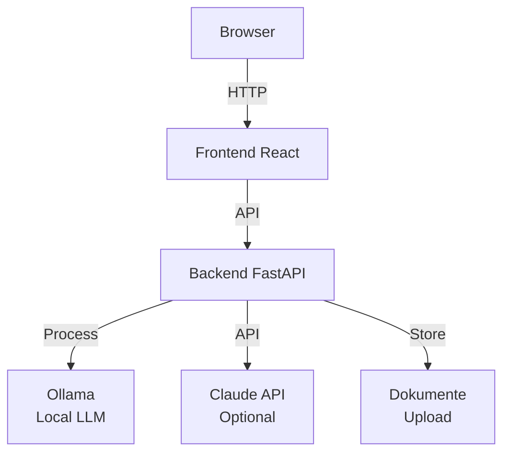

# LLM MCP Sandbox - Docker Setup

Lokale Sandbox-Umgebung für LLM-Dokumentenverarbeitung mit Model Context Protocol (MCP).

## Features

- 📄 PDF-Textextraktion mit PyPDF2
- 📝 Office-Dokumente (DOCX, XLSX, PPTX)
- 🤖 Claude API Integration
- 🐳 Vollständig containerisiert
- 🔒 Lokale Verarbeitung

## Voraussetzungen

- Docker Desktop für macOS
- Optional: Anthropic API Key (für Claude)
- Optional: GPU für bessere Performance (Ollama nutzt GPU automatisch)

## Installation

1. **Environment-Datei:**

```bash
cp .env.example .env
```

Bearbeite `.env` und füge deinen Anthropic API Key ein:

```bash
ANTHROPIC_API_KEY=sk-ant-...
```

## Starten

Beim ersten Start lädt Ollama automatisch das gewählte Modell herunter (kann einige Minuten dauern):

```bash
# Container bauen und starten
docker-compose up --build

# Im Hintergrund starten
docker-compose up -d

# Manuell ein Modell herunterladen
docker exec -it llm-mcp-sandbox-ollama-1 ollama pull llama3.2
```

Die Anwendung ist verfügbar unter:

- Frontend: [http://localhost:3000]
- Backend API: [http://localhost:8000]
- Ollama API: [http://localhost:11434]

## Verfügbare Modelle

Empfohlene Modelle für Dokumentenverarbeitung:

| Modell | Größe | Beschreibung |
|--------|-------|-------------|
| `llama3.2` | ~2GB | Schnell, gut für Chat |
| `llama3.2:70b` | ~40GB | Sehr leistungsstark |
| `mistral` | ~4GB | Gut ausbalanciert |
| `mixtral` | ~26GB | Sehr gut für komplexe Aufgaben |
| `codellama` | ~4GB | Spezialisiert auf Code |
| `phi3` | ~2GB | Klein und effizient |

### Modell wechseln

```bash
# .env bearbeiten
LOCAL_MODEL=mistral

# Container neu starten
docker-compose restart backend

# Oder direkt im Container
docker exec -it llm-mcp-sandbox-ollama-1 ollama pull mistral
```

## Verwendung

1. Öffne [http://localhost:3000]
2. Wähle zwischen lokalem LLM (Ollama) oder Claude
3. Lade Dokumente hoch (PDF, DOCX, XLSX, PPTX, TXT)
4. Stelle Fragen zu deinen Dokumenten
5. Der Assistent antwortet basierend auf dem Kontext

## API Endpoints

- `GET /` - Status und Konfiguration
- `GET /health` - Health Check (inkl. Ollama-Status)
- `GET /models` - Liste verfügbarer Modelle
- `POST /upload` - Dokument hochladen
- `POST /chat` - Chat mit LLM (local oder Claude)
- `POST /ollama/pull` - Modell herunterladen

## Stoppen

```bash
docker-compose down

# Mit Volumes löschen
docker-compose down -v
```

## Logs anzeigen

```bash
# Alle Services
docker-compose logs -f

# Nur Backend
docker-compose logs -f backend

# Nur Frontend
docker-compose logs -f frontend
```

## Troubleshooting

**API Key nicht gesetzt:**

```bash
docker-compose restart backend
```

**Port bereits belegt:**

Ändere die Ports in `docker-compose.yml`:

```yaml
ports:
  - "3001:3000"  # Frontend
  - "8001:8000"  # Backend
```

### Ollama lädt nicht

```bash
# Ollama-Container prüfen
docker-compose logs ollama

# Manuell starten
docker-compose up ollama

# Modell manuell laden
docker exec -it llm-mcp-sandbox-ollama-1 ollama pull llama3.2
```

**Container neu bauen:**

```bash
docker-compose build --no-cache
docker-compose up
```

## Architektur



## Unterstützte Dateiformate

- PDF (`.pdf`)
- Word (`.docx`)
- Excel (`.xlsx`, `.xls`)
- PowerPoint (`.pptx`)
- Text (`.txt`)

## Sicherheit

- Alle Daten bleiben lokal
- Nur extrahierte Texte werden an Claude API gesendet
- Originaldateien verbleiben im Upload-Verzeichnis
- API Key nur im Backend Container

## Entwicklung

Frontend Code ändern:

```bash
# Änderungen werden automatisch geladen (Hot Reload)
# Dateien im frontend/src/ Verzeichnis bearbeiten
```

Backend Code ändern:

```bash
# FastAPI mit --reload läuft automatisch neu
# Dateien im backend/ Verzeichnis bearbeiten
```

## Lizenz

MIT
